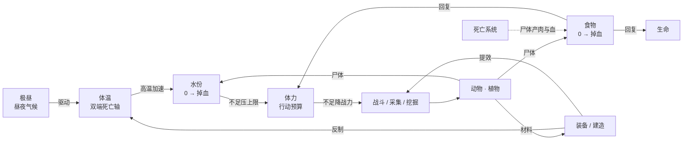

# 生存系统设计（生存篇 / 生化篇）

> 版本：v1 · 2026-08-07
> 范围：九大系统的完整重新设计 —— 极昼、体温、水份、食物、体力、死亡、动物、植物、装备，外加生化篇专属的感染与僵尸王。
> 基线：本文档以现有 `src/game/simulation/GameSimulation.ts` 的实际数值为基线做扩展，凡是改动既有数值的地方都在 §15 差异清单中单独列出，不做静默修改。

---

## 0. 设计定位

### 0.1 两个篇章

| | 生存篇 | 生化篇 |
| --- | --- | --- |
| 主题 | 与环境对抗：昼夜温差、饥渴、体力枯竭 | 与环境 + 病毒对抗：在生存压力下清除感染源 |
| 开局 | 空手落入荒漠 | 直升机坠毁点苏醒，身边是燃烧的机骸 |
| 主要敌人 | 动物（沙狼、鬣狗、巨蝎） | 僵尸三种 + 僵尸王 |
| 胜利条件 | 存活到第 N 天天亮（默认 N=5） | 击杀僵尸王**并**活到天亮 |
| 失败条件 | 冻死 / 热死 / 饿死 / 渴死 / 被杀 | 上述 + 感染值满 100 变异 |
| 复用比例 | — | 生存篇全部系统 100% 复用，只叠加感染层 |

生化篇不是另一个游戏，是生存篇之上的**一层敌人与一条新资源轴**。所有代码路径共用。

### 0.2 核心设计主张

原始设定里九个系统是**并列**的，玩家要同时盯九个表，这会变成杂务清单。本次重新设计把它们串成一条**单向因果链**，让玩家只需要理解一件事：



一句话概括玩法：**太阳逼你喝水，喝水逼你找井，找井要体力，体力要吃饭，吃饭要打猎，打猎要装备，装备要植物和兽皮，而夜里这一切都会反过来杀你。**

### 0.3 明确不做的内容

| 项目 | 决定 | 替代承接 |
| --- | --- | --- |
| 有毒动物 + 解毒药系统 | **移除**（2026-08-07 决策） | 「中毒」这一类风险由**生肉食物中毒**（§5.2）和**生化篇感染值**（§11.2）承接；巨蝎保留为高伤害伏击型，不带毒 DoT |
| 装备缓冲体温 | **不恢复**（沿用 2026-08-07 既有决策） | 皮衣只给防御；抗热改由**遮阳斗篷降低水份消耗**（间接抗热）和**遮阳棚/挖沙掩体降温**（环境项）实现 |
| 单人模式的队友尸体 | 默认关闭 | 见 §7.4，仅作联机预留 |

---

## 1. 玩家基础属性

沿用现有 `PlayerState`，新增两条轴。

| 属性 | 范围 | 初始 | 现状 | 归零/触顶后果 |
| --- | --- | --- | --- | --- |
| 生命 health | 0–100 | 100 | 已有 | 死亡 |
| 体温 warmth | 0–100 | 50 | 已有 | **双端死亡**：0 失温，100 热射病 |
| 饱食 hunger | 0–100 | 82 | 已有 | HP −2.6/s |
| 水份 thirst | 0–100 | 80 | **新增** | HP −3.2/s，体力上限压到 55 |
| 体力 stamina | 0–上限 | 100 | **新增** | 不能冲刺/攻击，移速 ×0.6 |
| 感染 infection | 0–100 | 0 | **新增（仅生化篇）** | 100 变异死亡 |
| 攻击 attack | — | 28 | 已有 | — |
| 防御 defense | — | 2 | 已有 | — |
| 基础移速 | — | 8.2 | 已有 | — |

**四轴的时间常数刻意错开**，避免同时告急造成的"一起烧"：

| 轴 | 满 → 空耗时（无补给） | 节奏定位 |
| --- | --- | --- |
| 体温（夜间无火） | ~31 s（峰值时更短） | **秒级**，最紧急，逼你回火边 |
| 水份（白天行动） | ~190 s | **分钟级**，规划一次外出的半径 |
| 饱食 | ~250 s（建议值 0.40/s） | **昼夜级**，一天备一次粮 |
| 体力 | ~7 s 满速冲刺 | **动作级**，单场战斗内的资源 |

---

## 2. 极昼系统（昼夜气候）

> 原设定的"极昼系统"实质是**昼夜温度驱动器**。重新设计为可配置的**气候档案 ClimateProfile**，同一套代码驱动雪脊、荒漠、生化三张图。

### 2.1 从阶跃改为曲线

现状是阶跃函数：白天恒定 +1.2/s，夜晚恒定 −1.6/s，天一黑就瞬间翻转。问题是玩家没有预警窗口，且"正午"和"深夜"毫无差别。

改为带过渡带与峰值的曲线：

```ts
// phaseTime / phaseDuration 都是现有字段
const p = 1 - phaseTime / phaseDuration;              // 相位进度 0 → 1
const edge = smoothstep(0, 0.15, p) * smoothstep(0, 0.15, 1 - p);
const shape = 0.35 + 0.65 * edge;                     // 边界 0.35，中段 1.0
const noonBoost = 1 + 0.5 * edge;                     // 中段再 ×1.5
const base = phase === "day" ? profile.dayRate : -profile.nightRate;
const ambient = base * shape * noonBoost;             // 0.35×base ～ 1.5×base
```

以现行雪脊夜间 `nightRate = 1.6` 为例：

| 时刻 | 环境速率 | 体感 |
| --- | --- | --- |
| 黄昏（相位 0%） | −0.56/s | 缓冲带，来得及跑回营地 |
| 入夜（相位 15%） | −1.6/s | 正常压力 |
| 深夜（相位 50%） | −2.4/s | 峰值，必须在火边 |
| 黎明（相位 100%） | −0.56/s | 松口气 |

**关键性质**：曲线在整个相位上的**积分与现行常量基本相等**，所以不破坏已经调好的手感，只是把压力重新分配出节奏。

### 2.2 气候档案表

| 档案 | 白天时长 | 夜晚时长 | dayRate | nightRate | 主死因 | 用途 |
| --- | --- | --- | --- | --- | --- | --- |
| `snow-ridge`（现行） | 120 s | 135 s | +1.2 | 1.6 | 冻死 | 现有雪脊图，数值不动 |
| `desert-polar-day` | **180 s** | 75 s | **+2.6** | 1.8 | **热死** | 极昼荒漠，白昼漫长，主打中暑 |
| `desert-standard` | 130 s | 120 s | +2.0 | 1.9 | 双向 | 荒漠常规，昼夜都要管 |
| `outbreak-night` | 90 s | 150 s | +1.4 | 1.7 | 冻死 + 感染 | 生化篇，夜长利于僵尸 |

首个昼夜单独放宽用于引导：雪脊 55/105（现行），荒漠 70/60，生化 60/90。

### 2.3 天气事件

在气候曲线之上叠加随机事件，每个相位最多 1 次。

| 事件 | 触发 | 时长 | 效果 |
| --- | --- | --- | --- |
| 沙尘暴（荒漠·白天） | 白天中段 35% 概率 | 40 s | 视距 −60%，水份消耗 ×1.5，体温 −0.5/s，**掩埋 1 口水井**（需重挖 1 次） |
| 热浪（荒漠·正午） | 白天中段 25% 概率 | 30 s | 环境项 ×1.6，遮阳区效果 ×1.3（奖励躲阴影） |
| 寒潮（雪脊/生化·夜） | 夜间 30% 概率 | 45 s | 环境项 ×1.5，篝火燃料消耗 ×1.4 |
| 阴云（任意·白天） | 20% 概率 | 50 s | 环境项 ×0.5，是白天的喘息窗口 |

事件必须有**提前 8 秒的可视 + 可听预告**（地平线扬沙、风声渐强），否则是纯随机惩罚。

---

## 3. 体温系统

### 3.1 结构：独立分量求和（沿用现有架构）

现有代码已经是"三个独立分量相加"，本设计保持这个结构，只是扩充分量表并加上限幅。

| 分量 | 速率 | 生效条件 | 状态 |
| --- | --- | --- | --- |
| 环境 | §2.1 曲线 | 始终 | 改造（原为常量） |
| 篝火 | **+3.0/s** | 距燃烧篝火 < 8.2 | 已有，不动 |
| 火把 | +1.5/s | 手持且点燃 | 新增 |
| 遮阳（棚 / 岩影 / 洞穴 / 沙坑） | **−1.8/s** | 半径 5 内 | 新增 |
| 浸水（井口 / 绿洲） | **−3.5/s** | 站在水体内 | 新增 |
| 天气事件 | 见 §2.3 | 事件期间 | 新增 |

```ts
warmthDelta = clamp(ambient + fire + torch + shade + water + weather, -6.0, +6.0);
```

**限幅 ±6.0/s 是必须的**：夜间火边（+3.0 − 2.4 = +0.6）和白天火边（+3.0 + 3.9 = +6.9）差距过大，不限幅会让"白天靠近火"从"有点危险"变成"两秒暴毙"，玩家来不及反应。

### 3.2 阈值效果表

| 体温 | 状态 | 效果 |
| --- | --- | --- |
| **0** | 失温死亡 | `endGame("frozen")` |
| < 10 | 濒危 | HUD 红警「即将冻死」，画面结霜，心跳音 |
| < 20 | 严寒 | 移速 ×0.84，攻击 ×0.8，体力上限 60 |
| 20–40 | 偏冷 | HUD 提示「体温过低」，无数值惩罚 |
| **40–60** | 舒适区 | 无任何惩罚，水份消耗基准 ×1.0 |
| 60–75 | 偏热 | HUD 提示「体温偏高」，水份消耗开始加成 |
| > 80 | 中暑 | 移速 ×0.84，攻击 ×0.8，体力上限 60，画面热浪扭曲 |
| > 90 | 濒危 | HUD 红警「即将过热」，画面泛白过曝，耳鸣音 |
| **100** | 热射病死亡 | `endGame("overheated")` |

现有代码的惩罚阈值是不对称的（`warmth < 25` 管移速，`warmth < 20` 管攻击，高温端完全没有惩罚，只有死亡）。本表**统一为对称的 20 / 80**，让双端死亡轴在体感上真正对称。

### 3.3 主动降温手段（原设定的核心趣味点）

| 手段 | 体温变化 | 代价 | 冷却 | 说明 |
| --- | --- | --- | --- | --- |
| 泼水降温 | **−18** 瞬时 | 水份 −25 | 5 s | 有效但奢侈，对应原设定"用水很浪费" |
| **秽泥涂抹** | **−12** 瞬时 | 卫生 −20（生化篇 感染 +5） | 30 s | 免费但恶心，对应原设定；见下方开关说明 |
| 芦荟膏 | −10 瞬时，并 5 s 内 +25 HP | 消耗 1 个 | — | 需植物系统的芦荟 |
| 挖沙掩体（需铲） | 60 s 内提供 −1.5/s 遮阳 | 体力 −18 | — | 荒漠中随处可造的临时阴影 |
| 跳进井/绿洲 | −3.5/s 持续 | 暴露在开阔地，动物会来 | — | 最强降温，但位置固定且危险 |
| 熄灭/远离篝火 | 移除 +3.0/s | 失去夜间保障 | — | 白天最容易被忽略的操作 |

**关于「秽泥涂抹」**：这是原设定里最有记忆点的机制（免费降温，代价是恶心和卫生），保留它。同时提供内容开关 `crudeContent`：

- `true`（默认，忠于原设定）：文案为「就地取材降温」，动作有明确的玩家反应演出。
- `false`：同一机制换皮为「涂抹湿泥」，数值完全一致，用于对内容敏感的发行渠道（Poki 等休闲平台建议关闭）。

数值和代码路径共用，只切文案与特效，不做两套逻辑。

### 3.4 升温手段

| 手段 | 效果 | 代价 |
| --- | --- | --- |
| 靠近篝火 | +3.0/s | 需持续添柴 |
| 添柴 | 篝火 +95 s 燃烧（现有值） | 木 ×1 |
| 点燃火把 | +1.5/s，且可移动 | 火把耐久 60 s |
| 进入洞穴/背风崖穴 | 环境项 ×0.6 | 位置受限 |
| 穿兽皮衣 | **无体温效果**（沿用既有决策） | — |
| 吃热食（烤肉/骨汤） | +6 体温瞬时 | 消耗食物 |

---

## 4. 水份系统

### 4.1 消耗公式

```ts
thirstRate = 0.30                                        // 基准
  * (1 + Math.max(0, (warmth - 55) / 45) * 1.6)          // 体温耦合：warmth=100 时 ×2.6
  * activityMul                                          // 见下表
  * gearMul;                                             // 遮阳斗篷白天 ×0.75
```

| 活动状态 | activityMul |
| --- | --- |
| 休息中（`resting`） | 0.60 |
| 静止 | 0.80 |
| 移动 | 1.15 |
| 双手搬运 | 1.30 |
| 冲刺 | 1.60 |

**体温耦合是这个系统的设计核心**：它把"极昼"从一个装饰性的光照变化，变成了直接掏空你水囊的经济压力。在 `desert-polar-day` 档案下，正午暴走的耗水速率是夜间静止的 **3.7 倍**，玩家会自发形成"正午躲阴影、清晨黄昏赶路"的作息 —— 这正是荒漠生存该有的行为。

### 4.2 阈值效果

| 水份 | 效果 |
| --- | --- |
| **0** | HP −3.2/s，体力上限 55，画面强烈色差与耳鸣，`deathCause = "dehydrated"` |
| < 15 | HUD 红警「严重脱水」，屏幕边缘热浪抖动 |
| < 25 | 体力上限 55，体力回复速率 ×0.5 |
| < 40 | HUD 提示「口渴」 |
| ≥ 40 | 无惩罚 |

### 4.3 水源表

| 水源 | 获取方式 | 补水 | 再生 / 存量 | 风险 |
| --- | --- | --- | --- | --- |
| **水井**（可自建） | 石铲 + 挖掘 3 次（每次 4 s，体力 −18） | 每次汲水 **+22** | 存量 5，每 120 s 回 1 | 可被沙尘暴掩埋，需重挖 1 次 |
| 绿洲 / 水潭 | 直接饮用 | +25 | 无限 | 固定 2 处，开阔暴露，夜间动物聚集 |
| 仙人掌汁 | 需刀采集 | +16（+3 饱食） | 240 s 再生 | 无 |
| 骆驼驼峰水囊 | 击杀骆驼 | **+30 ×2** | 不可再生 | 尸体引来秃鹫与鬣狗（§7.2） |
| 沙枣 / 椰枣 | 徒手采集 | +6（+18 饱食） | 240 s 再生 | 无 |
| 血液（动物尸体） | 需刀，尸体新鲜期内 | +12（饱食 −4） | 每具 1 次 | 生化篇 感染 +8 |
| 融雪（雪脊图） | 篝火旁化雪 15 s | +20 | 无限 | 必须守在火边 |
| 净水 | 水囊装水 + 篝火煮沸 20 s | **+28，无任何风险** | — | 生化篇中未净化的水 感染 +10 |

### 4.4 携带

| 容器 | 配方 | 容量 | 说明 |
| --- | --- | --- | --- |
| 无 | — | 0 | 只能在水源处即饮 |
| 水囊 | 兽皮 2 + 树脂 1 | 2 份 | 每份 = 1 次饮用量 |
| 大水囊 | 水囊 + 兽皮 2 | 4 份 | |

水囊把"水源"变成"补给站"，直接决定玩家的**外出半径**。没有水囊时你只能围着井转，做出水囊之后地图才真正打开 —— 这是荒漠图的第一个关键进度节点。

---

## 5. 食物系统

### 5.1 消耗

```ts
hungerRate = HUNGER_BASE                        // 现行 0.55，建议改为 0.40，见下
  * (warmth < 20 || warmth > 80 ? 1.3 : 1.0)    // 极端体温加速代谢
  * (isMoving ? 1.1 : 1.0);
```

**关于 0.55 → 0.40 的建议**：现行 0.55/s 是在"只有饥饿一条时间轴"的前提下调出来的（满→空约 3 分钟，已经很紧）。加入水份之后，玩家要同时应付两条掉得一样快的轴，实测会退化成"全程在找补给、没时间做别的"。建议把饥饿基准降到 **0.40/s**（满→空约 4 分钟），把腾出来的压力预算让给水份 —— 因为水份有体温耦合，能产生更有层次的玩法。

若希望保持现有难度，也可维持 0.55，但那样必须把水份基准降到 0.20/s，否则总压力翻倍。**两条轴的压力总和应保持在原来的 1.3 倍以内**，这是本次调整的红线。

### 5.2 食物表（五维收益）

| 食物 | 饱食 | 水份 | 体力 | 生命 | 风险 / 备注 |
| --- | ---: | ---: | ---: | ---: | --- |
| 沙枣 / 野果 | +18 | +6 | +8 | +3 | 现有 berry，追加水与体力 |
| 椰枣 | +14 | +4 | +6 | +2 | 绿洲棕榈产出 |
| 仙人掌肉 | +8 | +16 | +4 | 0 | 主力补水食物 |
| 虫 / 小蜥蜴 | +10 | +2 | +3 | 0 | 可生食无风险，保底食物 |
| **生肉** | +12 | +4 | 0 | 0 | **25% 概率食物中毒**：10 s 内 HP −12，体力上限 −20 持续 20 s |
| **烤肉** | **+38** | 0 | **+25** | +8 | 现有值 +38/+8，追加体力 |
| 肉干 | +26 | −4 | +14 | +2 | **不腐坏**，远征专用 |
| 骨汤 | +30 | +20 | +20 | +12 | 需陶锅 + 火 + 1 份水，最强食物 |
| 血液 | −4 | +12 | 0 | 0 | 生化篇 感染 +8 |
| 腐肉 | +6 | 0 | 0 | −10 | 60% 中毒；仅在绝境下有意义 |

### 5.3 腐坏

| 阶段 | 时间（背包内） | 状态 |
| --- | --- | --- |
| 生肉 | 0–240 s | 正常 |
| 生肉 → 腐肉 | 240 s | 自动转换，HUD 提示 |
| 烤肉 | 0–420 s | 正常 |
| 烤肉 → 腐肉 | 420 s | 自动转换 |
| 肉干 | 永久 | 不腐 |

腐坏的存在把"打到肉就赢了"变成"打到肉之后还得管理它"，也给了**烤肉→肉干**这条加工链存在的理由。地面掉落物沿用现有 `DROP_LIFETIME = 180`。

### 5.4 加工站

| 站点 | 解锁方式 | 可做 |
| --- | --- | --- |
| 篝火 | 现有固定篝火 / 可自建（§10.3） | 烤肉、化雪、煮沸净水、烤伤口（生化篇） |
| 烘架 | 木 4 + 韧皮 2，放置物 | 烤肉 ×2 → 肉干 ×1（30 s） |
| 陶锅 | 黏土 3 + 火 | 骨汤（兽骨 2 + 水 1 + 任意肉 1） |

---

## 6. 体力系统

体力**不是死亡轴**，它是"每一个动作的价格"。它的作用是让其他所有系统的惩罚有一个统一的落点：饿了、渴了、冻着了、热着了，最终都表现为"你干不动活了"。

### 6.1 消耗表

| 行动 | 消耗 |
| --- | --- |
| 冲刺 | −14 / s |
| 轻攻击（木棒 / 石刀） | −7 / 次 |
| 重攻击（长矛 / 弓） | −10 / 次 |
| 采集（植物 / 矿） | −9 / 次 |
| 挖掘（井 / 沙坑） | −18 / 次 |
| 双手搬运（大石） | −3.5 / s |
| 攀爬陡坡（slope > 0.35） | −6 / s |
| 受到伤害 | −5 / 次 |

### 6.2 回复表

| 状态 | 回复 |
| --- | --- |
| 移动中 | 0 |
| 静止（未进入休息） | +6 / s |
| 休息中（现有条件：静止 5 s + 无威胁） | **+11 / s** |
| 篝火旁休息 | **+14 / s** |
| 食物 | 见 §5.2 |

### 6.3 上限压制

```ts
const penalty = Math.max(
  thirst  < 25 ? 45 : 0,
  hunger  < 25 ? 30 : 0,
  (warmth < 20 || warmth > 80) ? 40 : 0,
);
staminaCap = 100 - penalty;   // 取最严重的一项，不叠加
```

**取最大值而非累加**，是为了避免三项同时告急时上限归零导致完全无法操作 —— 那不叫困难，叫卡死。最坏情况上限 55，玩家仍能打两下、跑一小段去自救。

### 6.4 归零效果

| 体力 | 效果 |
| --- | --- |
| 0 | 无法冲刺、无法攻击、移速 ×0.6、攻击力 ×0.7（若强行触发） |
| < 20 | 呼吸声急促，HUD 体力条闪烁 |
| ≥ 20 | 正常 |

现有代码里 `hunger < 15 || warmth < 20` 直接乘 0.8 攻击力的逻辑，**改为经由体力上限间接生效** —— 收敛到一个出口，玩家更容易理解"为什么我变弱了"。

---

## 7. 死亡系统

### 7.1 玩家死因

扩展现有 `deathCause` 枚举：

| 死因 | 触发 | 结算文案方向 |
| --- | --- | --- |
| `frozen` | 体温 = 0 | 「你在黑夜里停止了颤抖」 |
| `overheated` | 体温 = 100 | 「太阳烧干了最后一滴汗」 |
| `starved` | 饱食 = 0 持续到 HP 归零 | 「你已经三天没有咀嚼过东西」 |
| `dehydrated` | 水份 = 0 持续到 HP 归零 | 「沙子里没有水，你的喉咙先知道了」 |
| `killed` | 被动物 / 僵尸击杀 | 「它们比你更熟悉这片荒漠」 |
| `infected` | 感染 = 100（生化篇） | 「你成为了你要阻止的东西」 |

结算页显示：存活天数、击杀数、挖井数、制作物数、最终四轴快照。

### 7.2 尸体三阶段（动物 / 敌人通用）

| 阶段 | 时间 | 可获得 | 附带效果 |
| --- | --- | --- | --- |
| 新鲜 | 0–60 s | 生肉、兽皮（需刀，+1 产出）、血液（需刀） | **气味源**：半径 18 内危险动物侦测半径 ×1.5 |
| 腐化 | 60–150 s | 只出腐肉 | 30 s 后**必定**吸引 1 只秃鹫；夜间 50% 概率引来鬣狗群 |
| 白骨 | > 150 s | 兽骨 ×1 | 气味消失 |

尸体不是一个静态战利品箱，它是一个**会随时间变成陷阱的定时装置**。这条设计让"打猎"有了后续决策：立刻剥皮取肉走人，还是留在原地引怪来打一波？

### 7.3 玩家遗骸（连续模式）

单人一局制默认**关闭**（死亡即结算）。开启「连续模式」时：

- 死亡点生成 `remains` 容器，保存全部背包与装备，存在 300 s。
- 下一局在同一地图开局，可跑尸回收；300 s 后遗骸消失，物资永久丢失。
- 遗骸同样是气味源，回收往往要打一场。

### 7.4 队友尸体（联机预留，单人不启用）

原设定的「队友死亡会留下他的肉和血」保留为**联机模式专属**：

| 产出 | 收益 | 代价 |
| --- | --- | --- |
| 人肉 | 饱食 +34 | 士气 −20（全队），生化篇 感染 +12 |
| 血袋 | 水份 +18 | 士气 −10，生化篇 感染 +8 |

需要引入士气/理智作为第五条轴，且涉及内容分级审查。**排在 P2 之后，单人版本不实现**，本节仅作接口预留说明。

---

## 8. 动物系统

> 按 2026-08-07 决策，**取消毒系动物与解毒药**。危险性改由伤害、护甲、群体行为和伏击机制承载。

### 8.1 三类划分

| 类型 | 行为准则 | 玩家心态 |
| --- | --- | --- |
| 温和 | 不主动攻击，被击后逃跑 | 「食物和水，但要追」 |
| 警戒 | 不主动攻击玩家，但争抢资源 / 尸体 | 「烦人，会打断你」 |
| 危险 | 主动侦测追击 | 「要么绕开，要么准备好」 |

### 8.2 名录（荒漠图）

| 动物 | 类型 | HP | 攻 | 防 | 速 | 活跃时段 | 群体 | 行为要点 | 掉落 |
| --- | --- | ---: | ---: | ---: | ---: | --- | --- | --- | --- |
| 沙兔 | 温和 | 18 | 0 | 0 | 5.6 | 全天 | 1 | 极易受惊，之字形逃跑 | 生肉 ×1 |
| 蜥蜴 | 温和 | 26 | 3 | 0 | 4.1 | 白天 | 1 | 白天在岩石上晒太阳，靠近钻洞 | 生肉 ×1，韧皮 ×1 |
| **骆驼** | 温和 | 140 | 0 | 3 | 3.2 | 白天 | 2–3 | 群居，击伤后全群逃散；血厚追不上 | 生肉 ×3，兽皮 ×2，**驼峰水囊 ×2** |
| 秃鹫 | 警戒 | 40 | 8 | 1 | 4.8（飞） | 白天 | 1–2 | 盘旋在尸体上空，**抢夺地面掉落物** | 生肉 ×1，羽毛 ×2 |
| 沙狼（小） | 危险 | 58 | 10 | 1 | 3.65 | 夜间 | 3–6 | 沿用现有狼 AI（视野/追击/脱离/撤退） | 生肉 ×1，兽皮 ×1 |
| 沙狼（大） | 危险 | 112 | 16 | 5 | 2.85 | 夜间 | 1–2 | 现有大狼 | 生肉 ×2，兽皮 ×2 |
| **鬣狗** | 危险 | 76 | 13 | 2 | 4.0 | 黄昏 + 夜 | 3–5 | **会绕后包抄**，一只吸引正面其余绕侧；被尸体吸引 | 生肉 ×2，兽皮 ×1，犬牙 ×1 |
| **巨蝎** | 危险 | 150 | **22** | **8** | 2.6 | 夜间 | 1 | **沙下潜伏**，玩家进入 4 米内破沙突袭（首击 ×1.5）；高护甲，木棒几乎打不动 | 甲壳 ×3，螯钩 ×1 |

巨蝎是**装备门槛检测器**：8 点防御意味着 28 攻的木棒每下只有 20 伤害，要打 8 下；拿到粗铁矛（46 攻）后只需 4 下。它用一个具体的敌人告诉玩家"该升级武器了"，比任何 UI 提示都有效。

### 8.3 行为参数（统一 AI 框架）

现有 `WolfState` / `updateWolf` 泛化为 `AnimalState` / `updateAnimal`，`WolfKind` → `AnimalKind`。所有动物共用状态机：

```
entering → patrol → chase → attack → retreating → dead
                 ↘  flee  ↗
```

每种动物只是一组参数：

| 参数 | 说明 |
| --- | --- |
| `detectRadius` | 侦测半径（受气味修正，见 §8.4） |
| `chaseRadius` / `loseTime` | 追击范围与脱离时间（现有：34 s / 45 距离） |
| `packSize` | 出生时同时刷出的数量 |
| `activeWindow` | `"day" \| "night" \| "dusk" \| "all"`，非活跃时段不刷新且已存在个体回巢 |
| `fleeThreshold` | 温和动物受击后进入 flee 的血量比 |
| `ambush` | 巨蝎专用：潜伏 → 破沙突袭 |
| `flanking` | 鬣狗专用：包抄权重 |
| `scavenger` | 秃鹫/鬣狗：把最近尸体作为优先 anchor |

### 8.4 气味系统（跨系统耦合）

```ts
scent = 1.0
  + (背包生肉数量 * 0.15)      // 每份生肉 +15%
  + (身上有血液 ? 0.25 : 0)
  + (最近 10 s 内击杀过 ? 0.30 : 0);
detectRadius_effective = detectRadius * Math.min(scent, 1.8);
```

这条 8 行的规则让食物系统与动物系统真正咬合：**囤肉让你不容易饿死，但也让你更容易被吃掉。** 玩家因此需要在"多带肉"和"低调赶路"之间做真实取舍，而不是无脑塞满背包。

### 8.5 数量曲线

沿用现有夜间刷新框架（`spawnCountdown` 曲线、`MAX_WOLVES = 120`），把 target 拆到动物档案里。

**沙狼数量维持现行值不动**：2026-08-07 你明确反馈过「狼太少」，把每夜 target 从 `min(72, 42+(d-1)*10)` 上调到 `min(90, 40+(d-1)*15)`。新兵种是**叠加**，不是替换。

| 天数 | 沙狼（现行公式） | 鬣狗 | 巨蝎 | 秃鹫 | 夜间总数 | 说明 |
| ---: | ---: | ---: | ---: | ---: | ---: | --- |
| 1 | 40 | 0 | 0 | 0 | 40 | 含 1 只教学小狼（现有逻辑） |
| 2 | 55 | 6 | 0 | 1 | 62 | 引入包抄压力 |
| 3 | 70 | 10 | 1 | 2 | 83 | 引入装备门槛 |
| 4 | 85 | 14 | 2 | 2 | 103 | |
| 5+ | 90（上限） | 18 | 3 | 3 | **114** | 之后只提升个体属性 |

D5 总数 114 仍在 `MAX_WOLVES = 120` 之内，无需放宽上限。

**关于总压力**：叠加新兵种后 D5 的实际压力约为现行的 1.27 倍，鬣狗的包抄和巨蝎的高护甲还会额外放大体感难度。这可能偏高，但**下调需要一次专门实测，本文档不单方面改你已经调好的狼群曲线**。若实测确认过载，建议的削减优先级是：先砍沙狼数量（改回 `min(72, 42+(d-1)*10)`，D5 总数降到 96），再考虑推迟巨蝎到第 4 夜，**最后才动鬣狗** —— 因为鬣狗的包抄行为是"多兵种混编"这件事本身的价值所在，砍掉它等于白做。

---

## 9. 植物系统

### 9.1 名录

| 植物 | 分布 | 采集需求 | 产出 | 再生 |
| --- | --- | --- | --- | --- |
| 仙人掌 | 荒漠开阔地 | 徒手（汁）/ 刀（肉） | 仙人掌汁 ×2，仙人掌肉 ×1 | 240 s |
| 棕榈 | 绿洲 | 徒手（叶）/ 刀（椰枣） | 棕榈叶 ×2，椰枣 ×2 | 300 s |
| 骆驼刺 | 沙地散布 | 刀 | 韧皮 ×1，干草 ×1 | 180 s |
| 芦苇 | 井 / 绿洲边 | 徒手 | 芦苇杆 ×2 | 200 s |
| 沙枣树 | 稀疏林 | 徒手 | 沙枣 ×3 | 240 s |
| 芦荟 | 岩缝 | 刀 | 芦荟叶 ×1 | 300 s |
| 树脂灌木 | 岩地 | 刀 | 树脂 ×1 | 260 s |
| 地衣（雪脊） | 岩面 | 徒手 | 干草 ×1 | 200 s |

现有 `BerryPatch` 泛化为 `PlantNode { kind, charges, regrowAt, requiresTool }`，现有 32 处野果点直接成为其中一个 kind，`regrowAt` 逻辑（现行 180 s）保留。

### 9.2 材料 → 用途矩阵

| 材料 | 主要去向 |
| --- | --- |
| 韧皮 | 一切绑扎：石刀、木矛、水囊、斗篷、烘架 |
| 干草 | 引火（篝火/火把必需）、编织 |
| 树脂 | 防水（水囊）、粘合（箭）、助燃（火把） |
| 棕榈叶 | 遮阳斗篷、遮阳棚 —— **抗热路线的唯一材料** |
| 芦苇杆 | 箭杆、编织容器（背篓） |
| 芦荟叶 | 治疗膏、降温、生化篇血清 |

**韧皮是全局瓶颈材料**（8 个配方里 5 个要它），而它来自遍地都是的骆驼刺 —— 低价值高频采集，构成玩家在荒漠里的基础节奏动作。棕榈叶反过来：只在 2 处绿洲产出，是**抗热路线的卡点**，逼玩家在极昼图上必须至少往绿洲跑一趟。

### 9.3 采集规则

- 徒手可采：干草、叶、果实、汁液。
- 需刀：韧皮、树脂、仙人掌肉、芦荟叶 —— 这让**石刀成为第一个真正必要的工具**，而不是可选升级。
- 每次采集：体力 −9，耗时 1.2 s（有动作，可被打断）。
- 采集会产生轻微噪音，半径 12 内的危险动物有 30% 概率转为警觉。

---

## 10. 装备与合成系统

### 10.1 槽位

现有 `weapon` + `hasLeatherCoat` 扩展为五槽：

| 槽位 | 现状 | 说明 |
| --- | --- | --- |
| 主手（武器） | 已有 | 与"双手搬运"互斥（现有规则，保留） |
| 身体（护甲） | 已有（皮衣） | 只给防御，**不影响体温** |
| 头部 | 新增 | 遮阳类 |
| 背负（容器） | 新增 | 扩容 / 水囊 |
| 工具 | 新增 | 刀、铲、火把（可与武器同时携带） |

### 10.2 合成站分级

| 等级 | 站点 | 获取 | 解锁配方 |
| --- | --- | --- | --- |
| T0 | 随身 | 默认 | 石刀、火把、绳索、箭矢 |
| T1 | 燃烧的篝火 | 地图固定 / 可自建 | 木矛、粗铁矛、皮衣、水囊、烤制类 |
| T2 | 工作台 | 木 6 + 石 4，放置物 | 骨弓、甲壳护胸、大水囊、遮阳棚、烘架、石铲 |

现有"粗铁矛必须在燃烧篝火旁制作"的规则（`craftIronSpear` 里的 5.2 距离检查）保留，并推广为通用的站点距离检查。

### 10.3 配方表

**武器**

| 名称 | 配方 | 攻击 | 射程 | 耐久 | 站点 |
| --- | --- | ---: | ---: | ---: | --- |
| 木棒（初始） | — | 28 | 3.1 | ∞ | — |
| 石刀 | 燧石 2 + 韧皮 1 | +8 | 2.6 | 80 | T0 |
| 木矛 | 木 2 + 韧皮 1 | +14 | 3.6 | 100 | T1 |
| 粗铁矛（现有） | 铁矿 3 + 兽皮 1 | **+18** | 3.8 | 160 | T1 |
| 骨弓 | 兽骨 2 + 筋腱 2 + 木 1 | 16（远程） | 22 | 120 | T2 |
| 箭矢 ×5 | 芦苇杆 1 + 燧石 1 + 羽毛 1 | — | — | 消耗品 | T0 |

**护具与穿戴**

| 名称 | 配方 | 效果 | 站点 |
| --- | --- | --- | --- |
| 兽皮衣（现有） | 兽皮 4 | 防御 **+4** | T1 |
| 甲壳护胸 | 甲壳 3 + 筋腱 2 | 防御 +9，移速 −5% | T2 |
| **遮阳斗篷** | 棕榈叶 3 + 韧皮 2 | **白天水份消耗 ×0.75** | T1 |
| 遮阳帽 | 棕榈叶 2 + 韧皮 1 | 白天水份消耗 ×0.9 | T0 |

**工具与容器**

| 名称 | 配方 | 效果 | 站点 |
| --- | --- | --- | --- |
| 石铲 | 木 2 + 扁石 2 | **解锁挖井、挖沙掩体** | T2 |
| 火把 | 木 1 + 干草 2 + 树脂 1 | 光源 60 s，+1.5/s 体温，驱赶动物（半径 6） | T0 |
| 水囊 / 大水囊 | 见 §4.4 | 携带水 | T1 / T2 |
| 背篓 | 芦苇杆 4 + 韧皮 2 | **背包 +4 格** | T2 |

**建造物**

| 名称 | 配方 | 效果 |
| --- | --- | --- |
| 篝火 | 木 3 + 干草 2 + 燧石 1 | 可自建的火源，燃料机制同现有（木 ×1 = +95 s） |
| 遮阳棚 | 棕榈叶 4 + 木 3 | 半径 5 内 −1.8/s 体温 |
| 工作台 | 木 6 + 石 4 | 解锁 T2 |
| 烘架 | 木 4 + 韧皮 2 | 烤肉 ×2 → 肉干 ×1 |
| 水井 | 石铲 + 挖掘 ×3 | 见 §4.3 |

**可自建篝火是本次最大的自由度提升**：现在的三处固定篝火把玩家钉死在三个点上，一旦远征就必然在夜里冻死。可自建之后，"今晚在哪过夜"变成玩家的决策而不是地图的规定。

### 10.4 耐久

- 只有**武器和工具**有耐久，护甲和建造物没有 —— 避免制造无意义的重复劳动。
- 武器：每次命中 −1；工具：每次使用 −1。
- 耐久 0 时损坏（物品消失，有明确提示与音效）。
- 修理：在对应站点花费**半量材料**恢复满耐久。

### 10.5 背包压力（必须处理）

材料从 5 种涨到 17 种，现有 8 格背包会立刻爆掉。配套调整：

| 项 | 现状 | 调整为 |
| --- | --- | --- |
| 基础格数 | 8 | **12** |
| 背篓加成 | — | +4（合计 16） |
| 材料堆叠上限 | 3–6 | 材料类统一 **10**，食物类 5，工具不堆叠 |
| 快捷栏 | 无 | 新增 3 格快捷栏（水、食物、火把） |

不做这一步，装备系统会直接毁掉游戏体验 —— 这是 P1 阶段的**阻塞项**，不能延后。

---

## 11. 生化篇专属系统

### 11.1 场景与开局

开局在**坠毁的直升机**旁苏醒（现有地图已有 `wreck` 类型地标，直接复用并放大为主地标）。机骸持续燃烧 180 s，是开局的免费火源，也是第一波僵尸的引路信标。

### 11.2 感染值（第五条轴）

| 来源 | 感染增加 |
| --- | --- |
| 被僵尸命中 | +6 / 次 |
| 吃生肉 / 喝血 | +8 |
| 饮用未净化的水 | +10 |
| 停留在尸体半径 4 内 | +0.3 / s |
| 爆裂者感染云内 | +4 / s |
| 秽泥涂抹（§3.3） | +5 |

| 感染值 | 效果 |
| --- | --- |
| > 30 | 画面噪点，体力上限 −15 |
| > 60 | 最大生命 −20，攻击 −10%，听到低语音效 |
| > 85 | 视野边缘血管化，心跳音 |
| **100** | 变异死亡，`deathCause = "infected"` |

| 治疗手段 | 效果 | 代价 |
| --- | --- | --- |
| 抗体血清 | 感染 −40 | 芦荟叶 2 + 僵尸腺体 1 + 净水 1（T2） |
| 火烤伤口 | 感染 −12 | HP −8，需篝火，20 s |
| 净水冲洗 | 感染 −6 | 净水 ×1 |

感染是**不会自然回落**的单向轴 —— 它是生化篇的计时器，逼玩家不能无限拖延。

### 11.3 僵尸名录

| 类型 | HP | 攻 | 防 | 速 | 行为 |
| --- | ---: | ---: | ---: | ---: | --- |
| 游荡者 | 70 | 12 | 2 | 2.2 | 慢速直线，数量多，会被声音吸引（采集/攻击噪音） |
| 奔袭者 | 48 | 9 | 0 | **5.2** | 极快，**白天畏光会躲进阴影**，黄昏后倾巢而出 |
| 爆裂者 | 120 | 0 | 4 | 1.8 | 不直接攻击，**死亡时喷洒感染云**（半径 4，持续 12 s，+4 感染/s） |

爆裂者的设计意图是**惩罚无脑近战**：它血厚不打人，你可以不管它；但如果贪图它的腺体（血清材料）而在近处击杀，就要吃一脸感染云。想安全拿腺体，得用弓 —— 这给远程武器一个不可替代的理由。

### 11.4 感染源净化

地图上 3 处感染源：**坠机点 / 水井 / 村落废墟**。

- 净化需要：火把 + 燃料（木 3），持续引燃 25 s，期间僵尸持续来袭（守点战）。
- 每净化 1 处：该区域僵尸刷新率 −50%，全局掉落 1 个僵尸腺体。
- 净化 3 处 **或** 撑到第 4 夜 → 僵尸王出现。

### 11.5 僵尸王（BOSS）

| 项 | 数值 |
| --- | --- |
| HP | 2400 |
| 防御 | 12 |
| 基础速度 | 3.0 |
| 弱点 | **白昼与火焰伤害 ×1.5** |

| 阶段 | 触发 | 行为 |
| --- | --- | --- |
| P1 | 100%–60% | 直线冲撞（击退 + 眩晕 1 s），每 15 s 召唤 3 只游荡者 |
| P2 | 60%–25% | 追加**喷吐感染云**（地面残留 15 s，区域拒止），逼玩家不断换位 |
| P3 | < 25% | 狂暴：速度 +60%，改召奔袭者，攻击间隔 −30% |

**弱点设计即战术引导**：BOSS 在夜里几乎打不动，玩家的最优解是"拖到天亮"或"把它引到自己布置的篝火阵里"。这就要求玩家在 BOSS 战之前先用生存系统做准备（囤木头、提前造多个篝火、备好水和食物）—— 让生存篇的全部积累在最后一战里兑现，而不是被丢在一边打一场无关的动作战。

胜利条件：击杀僵尸王**且**存活至天亮（BOSS 死后仍有 30 s 的残余潮）。

---

## 12. HUD 与交互

### 12.1 状态条改版

现有三条（生命 / 温暖 / 饱食）扩为五条 + 生化篇第六条：

| 条目 | 样式 | 位置 |
| --- | --- | --- |
| 生命 | 常规左起条，红 | 左上第 1 |
| **体温** | **双向中心条**：0 在左（蓝），100 在右（红），50 处有中线刻度，指针从中间向两侧偏移 | 左上第 2 |
| 饱食 | 常规条，橙 | 左上第 3 |
| 水份 | 常规条，青 | 左上第 4 |
| 体力 | 常规条，黄；**移动端额外在攻击键下方放一个环形副本** | 左上第 5 |
| 感染 | 常规条，紫；仅生化篇显示 | 左上第 6 |

**体温必须改成双向条**。现在它是普通的左起进度条，但语义上 0 和 100 都是死 —— 玩家看到条"变长"会本能地以为在变好，这是直接致命的误读。改成中心刻度后，"往中间靠"就是唯一正确的直觉。

体力条放在攻击键旁边，因为它是**动作预算**而非生存指标，玩家需要在按攻击的瞬间余光看到它。

### 12.2 新增交互

| 操作 | 桌面 | 移动 |
| --- | --- | --- |
| 冲刺 | Shift | 摇杆推到边缘 2 s |
| 喝水 | Q / 快捷栏 | 快捷栏按钮 |
| 使用工具（挖 / 采） | E（沿用现有上下文行动） | 行动键 |
| 降温操作 | R（上下文：有水→泼水，无水→秽泥） | 长按行动键 |
| 建造菜单 | C | 建造按钮 |

沿用现有 `getInteractionHint()` 的上下文提示机制，扩展 `InteractionHint.action` 枚举：`"dig" | "gather" | "skin" | "drink" | "build" | "cool"`。

### 12.3 教学节奏（首个昼夜）

| 时间 | 引导 |
| --- | --- |
| 0–15 s | 「拿起圆木」（现有 objectiveStage 0） |
| 15–30 s | 「添入篝火」（现有 stage 1） |
| 30–45 s | **「口渴了 —— 找仙人掌」**（新，第一次水份告警时触发） |
| 45–60 s | 「采集骆驼刺 → 制作石刀」 |
| 60–70 s | 「天要黑了，体温会开始下降」 |
| 首夜 | 「守住火光」（现有） |

**水份告警必须在首个白天出现**，否则玩家会把这条新条当装饰，然后在第二天莫名其妙渴死。

---

## 13. 资源预算与难度曲线

### 13.1 一昼夜收支（`desert-standard`，130 s 白天 + 120 s 夜晚）

| 资源 | 白天消耗 | 夜晚消耗 | 合计 | 需要的补给量 |
| --- | ---: | ---: | ---: | --- |
| 水份 | ~68 | ~36 | **~104** | 5 次汲水（1 口井全额）或 4 株仙人掌（每株 2 份汁） |
| 饱食 | ~52 | ~48 | **~100** | 3 份烤肉 或 6 个野果 |
| 木材（篝火） | 0 | 120 s 燃烧 | **2 根**（+1 根备用） | 地图散布充足 |
| 体力 | 视行动 | 视行动 | — | 休息 + 食物即可覆盖 |

设计意图：**一个白天的产出刚好够撑过一个夜晚，没有余量做别的**。想要余量（做装备、探索、建第二个营地），必须提升效率 —— 挖井（省来回）、做水囊（扩半径）、做斗篷（降消耗）。这就是荒漠图的成长曲线。

### 13.2 难度曲线

| 天 | 气候强度 | 动物压力 | 玩家应有进度 | 关键卡点 |
| ---: | --- | --- | --- | --- |
| 1 | ×0.7（教学） | 40（纯沙狼，现行值） | 石刀、生火 | 学会看四条轴 |
| 2 | ×1.0 | 62（+鬣狗） | 水囊、皮衣 | 包抄战术 |
| 3 | ×1.15 | 83（+巨蝎） | 石铲、水井、铁矛 | **装备门槛** |
| 4 | ×1.3 | 103（满编） | 工作台、遮阳棚 | 建立第二营地 |
| 5 | ×1.4 | 114（满编 + 属性提升） | 甲壳/骨弓 | 通关 |

生化篇在此之上叠加感染压力，且第 4 夜必出僵尸王。

---

## 14. 落地计划

### 14.1 分期

**P0 · 核心四轴（可独立验证，不依赖新美术）**

1. `types.ts`：`PlayerState` 增加 `thirst`、`stamina`、`staminaCap`；`GameEvent` 增加 `drink` / `stamina-empty`。
2. `GameSimulation.updateNeeds()` 拆为 `updateTemperature()` / `updateThirst()` / `updateHunger()` / `updateStamina()`。
3. 体温阶跃 → §2.1 曲线，加 ±6.0/s 限幅，惩罚阈值对称化为 20/80。
4. 饥饿基准 0.55 → 0.40（见 §5.1 论证）。
5. 食物表按 §5.2 扩展为五维收益。
6. HUD：五条状态条 + 体温双向条（`index.html` / `HudController.ts` / `styles.css`）。
7. 现有野果点临时兼作补水点，先跑通数值再补内容。

**P1 · 世界内容**

8. `WolfState` → `AnimalState`，`updateWolves` → `updateAnimals` + 动物档案表；接入鬣狗、骆驼、巨蝎、秃鹫。
9. `BerryPatch` → `PlantNode`，接入 8 种植物。
10. **背包扩容到 12 格 + 堆叠上限调整（阻塞项，必须与 11 同期）**。
11. 装备五槽位 + 合成站分级 + 配方表。
12. 挖井、可自建篝火、遮阳棚、工作台（新增 `PlacedStructure` 与放置逻辑）。
13. 气味系统、尸体三阶段。
14. 气候档案抽到 `mapBlueprint.json`，新增荒漠地图蓝图。

**P2 · 生化篇**

15. 感染轴 + HUD 第六条。
16. 三种僵尸（复用 `AnimalState` 框架）。
17. 感染源净化守点玩法。
18. 僵尸王三阶段 + 胜利结算。
19. 模式选择界面。

### 14.2 代码改动映射

| 文件 | 改动 |
| --- | --- |
| `src/game/simulation/types.ts` | `PlayerState` 扩字段；`AnimalState`/`AnimalKind`/`PlantNode`/`PlacedStructure`/`EquipmentSlots`/`ClimateProfile` 新类型；`InventoryItemKind` 扩到 ~20 种；`INVENTORY_CAPACITY` 8→12；堆叠上限表重写 |
| `src/game/simulation/GameSimulation.ts` | `updateNeeds` 拆分；`updateWolves`/`updateWolf` 泛化；新增 `updatePlants`/`updateStructures`/`updateCorpses`/`updateInfection`/`updateWeather`；`craftLeatherCoat`/`craftIronSpear` 归并为通用 `craft(recipeId)`；`endGame` 死因扩枚举 |
| `src/game/content/createWorld.ts` | 植物/动物/结构的程序化布点；荒漠蓝图分支 |
| `src/game/content/mapBlueprint.json` | 新增 `climate` 字段；新增荒漠地图 |
| `src/game/terrain/TerrainModel.ts` | 新增"可挖井地表"判定（沙质 + 低洼） |
| `src/render/GameRenderer.ts` | 五种植物 / 六种动物 / 建造物的程序化模型；热浪、沙尘暴、感染云后处理；`syncDayNight` 接气候档案 |
| `src/ui/HudController.ts` | 五/六条状态条；体温双向条；快捷栏；建造菜单；结算文案按新死因 |
| `index.html` / `src/styles.css` | HUD 结构与样式 |
| `src/audio/SynthAudio.ts` | 口渴/力竭/沙尘暴/感染/BOSS 音效 |

---

## 15. 与现有实现的差异清单

| 系统 | 保留 | 修改 | 新增 |
| --- | --- | --- | --- |
| 体温 | 双端死亡（0/100）、初始 50、篝火 +3.0/s、独立分量求和结构、**装备不影响体温** | 环境项阶跃 → 曲线；惩罚阈值对称化 20/80；加 ±6.0/s 限幅 | 遮阳、浸水、火把、天气分量；泼水/秽泥/芦荟主动降温 |
| 饥饿 | 归零掉血 −2.6/s；烤肉 +38/+8 | **基准 0.55 → 0.40**（附保持 0.55 的备选方案） | 五维收益；腐坏；肉干/骨汤；极端体温加速代谢 |
| 昼夜 | 相位框架、`getDaylight()`、首日 55/105 | 相位时长改由气候档案给出 | 气候档案表；正午/深夜峰值；4 种天气事件 |
| 动物 | 完整狼 AI（视野/追击/脱离/撤退/掉落）、夜间刷新曲线、**沙狼数量公式 `min(90, 40+(d-1)*15)` 不动**、大小狼分级 | `WolfState` → `AnimalState` 泛化 | 5 种新动物（叠加而非替换）；气味系统；群体包抄；沙下伏击；尸体清道夫 |
| 植物 | 野果点与再生逻辑 | `BerryPatch` → `PlantNode` | 8 种植物；工具门槛；材料矩阵 |
| 装备 | 皮衣防御 +4、铁矛攻击 +18、篝火旁制作限制、双手搬运与武器互斥 | 两个硬编码配方 → 通用配方表；背包 8 → 12 格 | 五槽位；T0/T1/T2 站点；14 个新配方；耐久与修理 |
| 死亡 | `deathCause` 字段与结算页 | 枚举扩到 7 种 | 尸体三阶段；遗骸回收；队友尸体（联机预留） |
| 水份 | — | — | **全新** |
| 体力 | 现有休息条件（静止 5 s + 无威胁 + 饱食 ≥20） | 休息同时回复体力 | **全新** |
| 生化 | — | — | **全新**：感染轴、3 种僵尸、净化玩法、僵尸王 |

### 15.1 需要决策的开放项

1. **饥饿基准**：0.40（推荐）还是维持 0.55 并把水份降到 0.20？影响整体节奏，建议 P0 阶段两套都跑一次实测。
2. **动物总压力**：新兵种叠加后 D5 达 114 只（现行 90）。本文档不动你已调好的沙狼曲线，但这需要一次实测确认；若过载，削减优先级见 §8.5。
3. **秽泥降温的内容开关**默认值：忠于原设定（开）还是面向 Poki 渠道（关）？
4. **地图取舍**：荒漠图是替换雪脊，还是作为并列的第二张图？本文档按"并列 + 气候档案切换"设计，若确定替换，可省掉 `snow-ridge` 档案的维护成本。
5. **连续模式 / 遗骸回收**是否要做？它会把单局体验变成 roguelite 结构，影响面较大。
